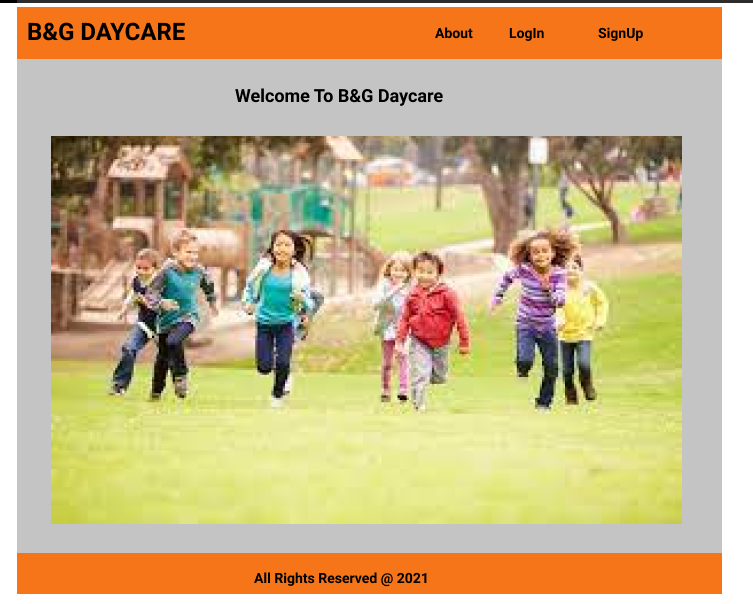
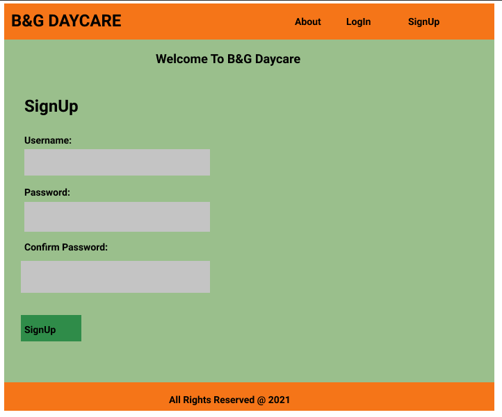
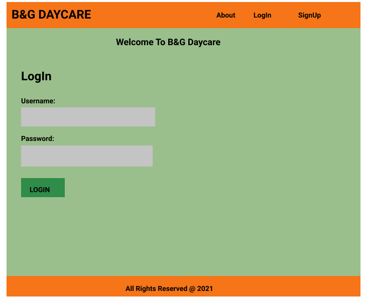
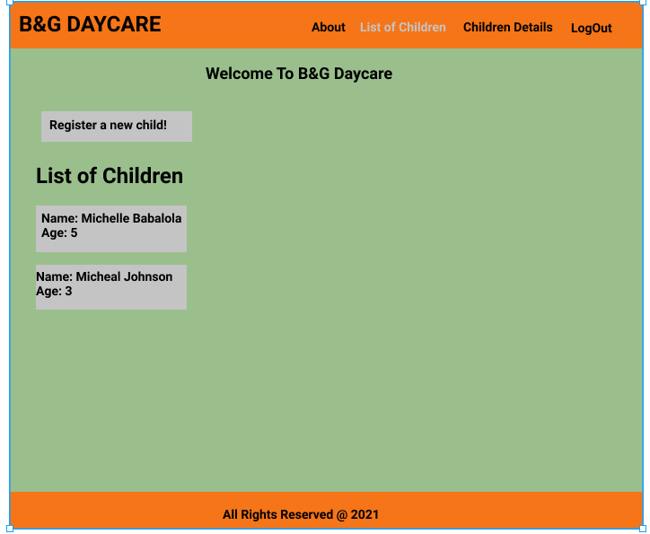
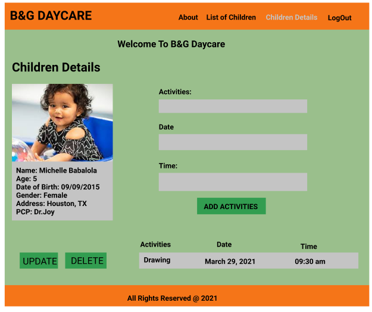
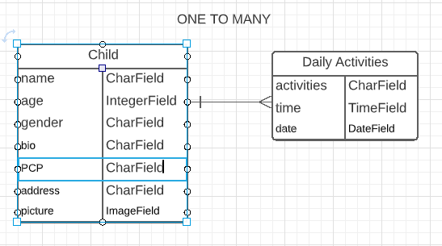

# Project Title

### B&G DAYCARE APP

* This is app is made for daycare 

### Motivation

* 
---
### Screenshots
screen captures of your app

---
### User Stories 

* The user will signup to user the app
* The current user will login each time to use the app
* The user will be able to add new children with their activities to her page
* The admin page will be different from users page

### Wireframes

---

## Technologies 
* Python
* Django
* Pymongo
* postgreql

###  Code Snippets
* 

## Data Models 

#### TO CREATE MODEL:
* child
* Daily-activiites

 

## ERD - entity relationship diagram
* one to many relationship

---

---
# Credits

---

### Future development
